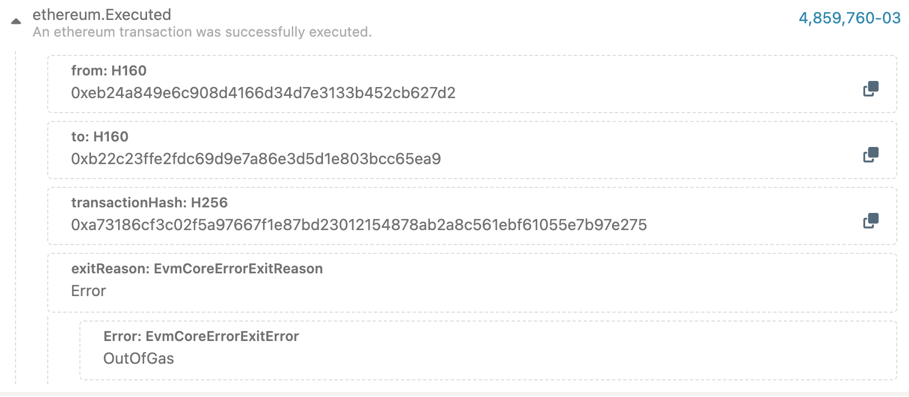

# Deploying and Verifying Smart Contracts with Foundry's forge CLI

This project showcases the deployment and verification of a basic smart contract on the TRN Porcini network using Foundry's `forge`` CLI. It includes a sample contract, a corresponding test, and a deployment script.

## Prerequisites:

To begin, make sure you have installed Foundry by following these steps:

1.  Run the command: `curl -L https://foundry.paradigm.xyz | bash`
2.  Restart your terminal
3.  Execute: `foundryup`
4.  Install the forge CLI tool by running: `cargo install --git https://github.com/gakonst/foundry --bin forge --locked`
5.  Run the commands below to your terminal:

    ```
    export DEPLOYER_PRIVATE_KEY={DEPLOYER_PRIVATE_KEY}
    export PORCINI_RPC_URL=https://porcini.rootnet.app/
    ```

    Note:
    Replace the placeholders such as `{DEPLOYER_PRIVATE_KEY}` with the appropriate value according to your specific setup.

6.  Then, run `forge install --no-commit` to install the required libraries for this project.

For more detailed instructions on the installation process, refer to the [official Foundry repository](https://github.com/foundry-rs/foundry).

## Procedure:

There are two methods to deploy contracts using Foundry:

1.  Using `forge create`

    Users can utilize the `forge create` command to deploy and verify a contract by specifying all the necessary parameters in the command. Here is an example:

    ```
    forge create \
        --rpc-url $PORCINI_RPC_URL \
        --private-key $DEPLOYER_PRIVATE_KEY \
        --legacy \
        --optimize \
        --optimizer-runs 200 \
        --use <SOLIDITY_VERSION> \
        --verify \
        --verifier sourcify \
        path/to/<CONTRACT_NAME>.sol:<CONTRACT_NAME> \
        --constructor-args {if necessary}
    ```

    Note:
    You can check out the shell script example included in this repo: `examples/evm/use-forge/script/use-forge-create.sh`

    In this example, we set the `--rpc-url` to TRN Porcini and specify the `--private-key` using environment variables (see #5 of Prerequisites section).

    Pay special attention to the `--legacy`` flag, as it is necessary for successful contract deployment on the TRN Porcini network. Failure to include this flag may result in errors (refer to the troubleshooting section for more information).

2.  Using `forge script`

    Users can also create a deployment script to automate the deployment process without having to provide the parameters each time. For detailed examples and information, refer to [this repository](https://github.com/futureversecom/trn-starter-foundry).

    However, note that there are known issues (explained further in the following section) when using `forge script`. If any errors occur during deployment, it is recommended to revert back to using `forge create`.

## Testing:

This project includes a test script written in Solidity (see `examples/evm/use-forge/test/Counter.t.sol` file). To run the test, execute the ff. in your terminal:

```
forge test
```

## Troubleshooting:

- `Deserialization Error: invalid type: null, expected f64 at line 1 column 240.`

  This error occurs when the `--legacy flag`` is not used during contract deployment. Including this flag will resolve the issue.

- `Failed to get EIP-1559 fees`

  This error also arises when the `--legacy`` flag is missing. Adding the flag will resolve the problem.

- `Transaction Failure: 0x9cfe621bac130205088168a30470f0cbfdacb22ebb7ce5869a348a7552b7e8b8`

  When this error occurs, the transaction has been executed on the chain but returns with an error. You can check the error code in the event broadcasted on the blockchain explorer, as shown in the example screenshot below.

  Possible errors: `OutOfGas`.

    

  One possible reason for this error is that the estimated gas is insufficient for the transaction. Increasing the `--gas-estimate-multiplier`` to 200 or higher may resolve the issue.

- `(code: -32603, message: submit transaction to pool failed: InvalidTransaction(InvalidTransaction::Custom(3)), data: None)`

  The `InvalidTransaction::Custom(3)` means `GasLimitTooLow` in frontier. A higher gas limit is required to avoid this error.

  Note:
  While using `forge script`, sometimes raising gas limit still cannot solve this error. In this case a workaround is to switch to `forge create`
